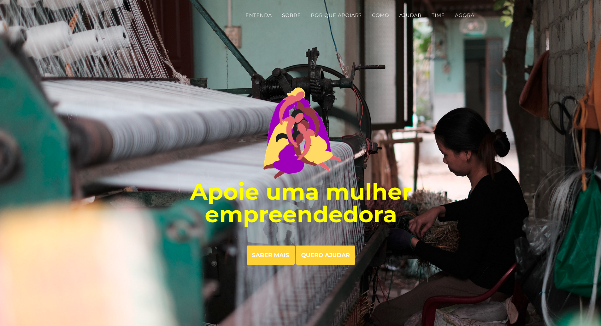

# 

### ✅ Nossa missão

O Amadrinha é uma plataforma que permite que empresas e pessas físicas apoiem microempreendedoras de baixa renda. Um dos grandes problemas que essas mulheres enfretam e que prejudica a evolução de seu negócio é o abalo mental provocado pela sobrecarga de funções. No intuito de mitigar adversidade, vamos possibilitar que o nosso público alvo tenha acesso ao tratamento psicológico, muito pouco utilizado por pessoas de baixa renda, e à uma rede de apoio, para que as microempreendedoras recebam dicas de empreendedorismo e também apoiem umas às outras. Existem outras plataformas que buscam conectar mulheres empreendedoras, mas observamos que não é dado o devido enfoque à saúde mental, o que consideramos como uma lacuna, visto que o público empreendedor é particularmente susceptível à problemas de saúde mental. Além disso, é comum que microempreendedoras periféricas não sejam impactadas por plataformas de empreendedorismo, visto que essas mulheres em muitos casos não possuem um grande acesso às mídias sociais e/ou encontram dificuldade em acessar a internet. Por isso, a nossa iniciativa manterá contato com ONGs e organizações governamentais que já atuam em periferias e por meio delas chegará no grupo de mulheres de baixa renda com pequenos negócios.

### ✅ Por que apoiar a nossa iniciativa?

Mudança social
As mulheres apoiadas terão acesso a tratamento psicológico e contato com outras microempreendedoras, fazendo com que cada uma delas acredite em seu potencial. O maior sucesso nos negócios e a consequente autonomia financeira vão gerar um grande impacto na vida dessas mulheres

 

Alcance efetivo do público alvo
Muitas iniciativas de apoio à mulher feitas online ainda ficam limitadas a um público alvo com relativamente mais recurso. Com o apoio de coletivos e organizações que já atuam em comunidades, o nosso projeto tem o potencial de chegar às microempreendedoras periféricas

 

Fomentar o empreendedorismo
É de interese do setor comercial que haja mais empreendedorismo no Brasil. Por que não apoiar uma população que tem potencial para mudar a cara do empreendedorismo no país?

## 📚Nosso time

▶Amanda
▶Juliana
▶Mariana
▶Rairany
▶Wallys

##

✅Deploy no Heroku:
